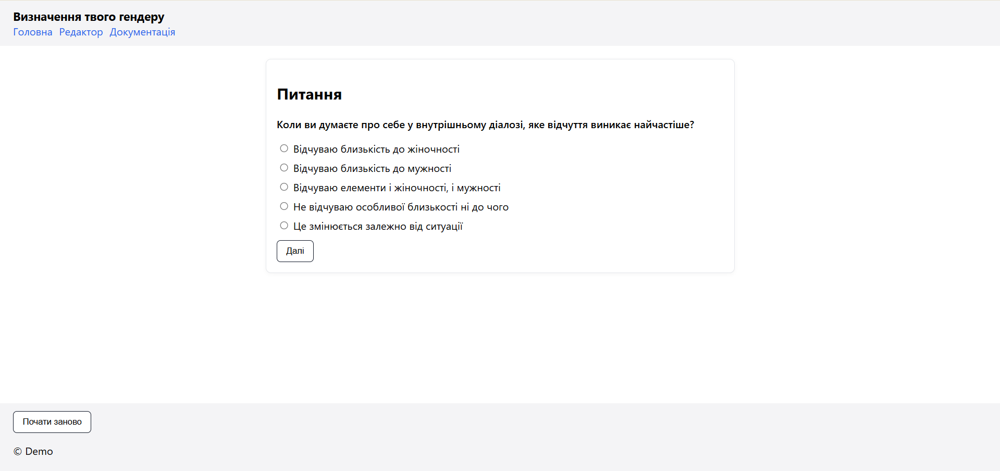

# Genderless

## Опис проекту

**Genderless** – це веб-додаток для інтерактивного визначення гендерної ідентичності на основі дерева рішень. Проект надає користувачам можливість пройти тест із послідовними питаннями та отримати персоналізований результат.

## Основні можливості

- **Інтерактивне тестування** - покрокове проходження питань із вибором відповідей
- **Візуальний редактор** - створення та редагування дерева питань та результатів
- **Система сесій** – збереження прогресу користувача під час проходження
- **Історія рішень** – відстеження шляху користувача через дерево
