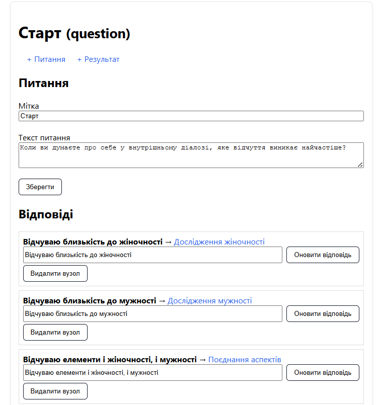
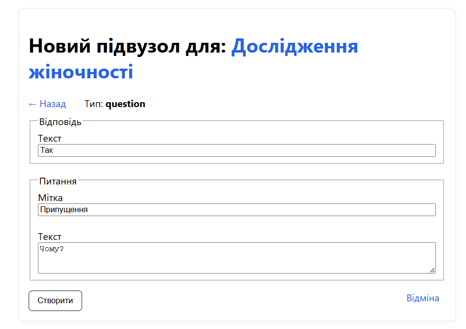
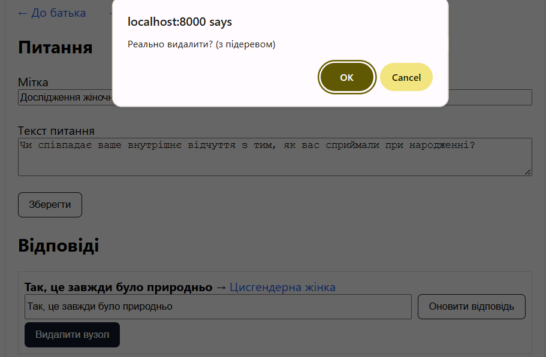

# Режим редактора

## Доступ до редактора

> Перейдіть за адресою `http://localhost:8000/editor` для режима редактора

## Навігація по дереву

**Перегляд вузлів:**

- Редактор відкривається з кореневого вузла дерева
- Кожен вузол показує свій тип (question/result)
- Відображається вміст та пов'язані вузли

**Переходи між вузлами:**

- Клік по посиланню дочірнього вузла для переходу
- Кнопка "_← До батька_" для повернення до батьківського вузла
- Навігація відображає ієрархію дерева

## Редагування дерева

### 1. Редагування питань

**Основні поля питання:**

- **Мітка** - коротка назва вузла для навігації
- **Текст питання** - основний текст, який бачить користувач
- Кнопка "_Зберегти_" застосовує зміни

**Управління відповідями:**

- Список усіх варіантів відповідей на питання
- Редагування тексту кожної відповіді inline
- Кнопка "_Оновити відповідь_" зберігає зміни

### 2. Редагування результатів

**Поля результуючого вузла:**

- **Мітка** - назва для навігації в редакторі
- **Значення** - основний результат тестування
- **Опис** - детальний опис результату (опціонально)

## Створення нових вузлів

**Додавання дочірніх вузлів:**

- Кнопка "_+ Питання_" створює нове питання
- Кнопка "_+ Результат_" створює новий результат
- Кожен новий вузол потребує вказання тексту відповіді

**Процес створення:**

1. Вибір типу вузла (питання або результат)
2. Заповнення тексту відповіді від батьківського вузла
3. Заповнення вмісту нового вузла
4. Автоматичне зв'язування з батьком

## Видалення вузлів

**Видалення дочірніх вузлів:**

- Кнопка "_Видалити вузол_" у секції кожної відповіді
- Підтвердження дії через Діалогове вікно
- **Видалення каскадно зачіпає все піддерево**

**Обмеження видалення:**

- Кореневий вузол неможливо видалити
- **Операція незворотня!**

## Автозбереження

- Усі зміни автоматично зберігаються у файл
- Використовується запис у файл

## Поради з використання

- Починайте з загальних питань, переходячи до специфічних
- Робіть питання чіткими та однозначними
- Варіанти відповідей мають бути взаємовиключними
- Після редагування проходьте тест для перевірки
- Переконайтеся, що всі шляхи ведуть до результатів
