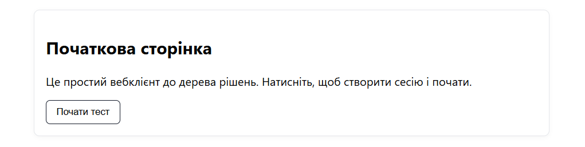
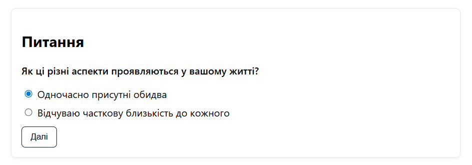
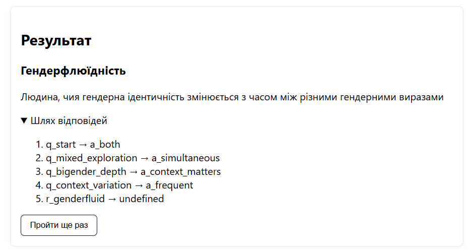

# Проходження ЕС

## 0. Початок

- Відкрийте `http://localhost:8000`
- Натисніть кнопку "Почати тест"

## Процес проходження

1. **Відповіді на питання**
   - На кожній сторінці відображається поточне питання
   - Оберіть один з запропонованих варіантів відповіді
   - Натисніть "Далі" для переходу до наступного питання

2. **Навігація по дереву**
   - Кожна відповідь визначає наступне питання або результат
   - Система автоматично відстежує обраний шлях
   - Історія рішень зберігається у сервері

## Отримання результату

3. **Фінальна сторінка**
   - Після досягнення листового вузла показується результат
   - Відображається підсумковий текст та опис
   - Є історія пройденого шляху
